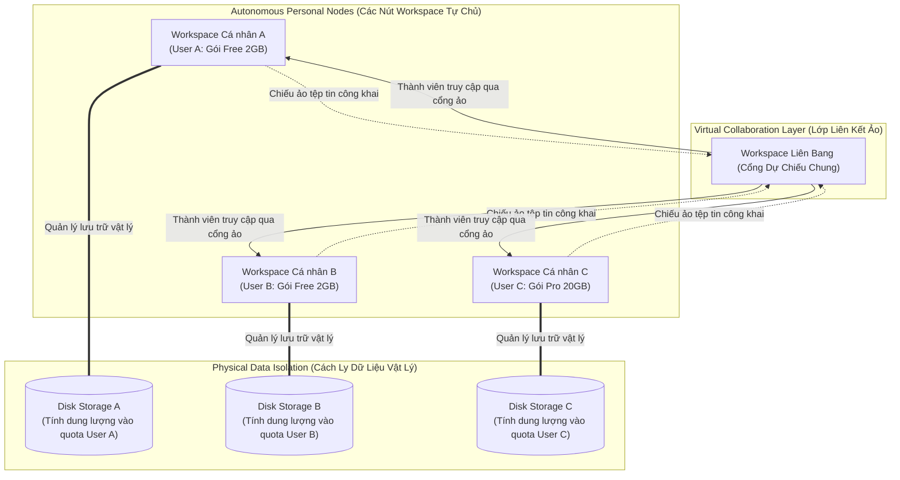
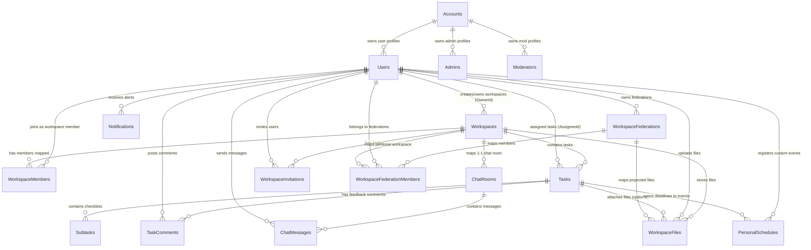

# ✨ UniGrid — Unified Workspace & Team Management

[](https://dotnet.microsoft.com/)
[](https://www.microsoft.com/sql-server)
[](https://tailwindcss.com/)
[](https://alpinejs.dev/)

> **A premium, high-visibility Workspace and Task Management platform designed specifically for students, academic clubs, and small startup teams (3–10 members).**

---

## 📖 Table of Contents
1. [Project Overview](#-project-overview)
2. [Target Audience & System Actors](#-target-audience--system-actors)
3. [Key Features](#-key-features)
4. [Tech Stack Architecture](#-tech-stack-architecture)
5. [Database Schema](#-database-schema)
6. [Getting Started & Local Setup](#-getting-started--local-setup)
7. [Security & gitignore Configuration](#-security--gitignore-configuration)

---

## 🚀 Project Overview

**UniGrid** addresses the fragmentation that teams experience when working across scattered task sheets, isolated Google Docs, and messy messaging channels (Messenger, Zalo). It consolidates tasks, deadlines, shared files, and real-time chat into **one highly loveable workspace interface**, solving accountability issues and missing timeline visibility.

### 💡 The Competitive Edge
* **Centralized Workspaces:** Combines Kanban boards, repository storage, and real-time SignalR chat rooms.
* **Native Deadline Sync:** Assigning a task inside a workspace automatically propagates that deadline directly into the assignee's personal dashboard calendar.
* **Transparent Contribution Metrics:** Computes real-time workspace member completion rates, helping prevent unequal workloads and the "free-rider" effect.
* **Vibrant Glassmorphic Aesthetics:** Built using premium colors, soft HSL gradients, and reactive hover animations.

---

## 👥 Target Audience & System Actors

### Target Audience
* **Students:** Managing semester-long group work, research circles, or thesis cohorts.
* **Small Startups:** Agile teams of 3–10 people demanding high speed without enterprise weight.
* **Student Clubs:** Teams looking for a setup lighter than Jira but more structured and action-oriented than Notion.

### Core Actors
1. **Guest:** Unauthenticated user. Can view the landing layout, read pricing comparisons, and register/login.
2. **User (Member):** Authenticated collaborator. Joins workspaces via secure codes, acts on assigned tasks, registers schedules, and chats.
3. **Workspace Owner (Leader):** Created elevated workspaces, manages membership, creates/assigns tasks, and controls board reviews.
4. **Admin (System):** Manages users, locking configurations, Billing packages, and global transactions.

---

## 🛠️ Key Features

### 📅 Native Calendar Sync & Dashboard
* Core metric indicators summarizing total, overdue, and pending workloads.
* Personalized calendar dynamically overlaying team deadlines onto personal events.

### 📋 Interactive task engine & Kanban Board
* 4-state workflow board: `Todo` ➔ `In Progress` ➔ `Review` ➔ `Done`.
* Dialog triggers displaying checkable checklists (subtasks), markdown descriptions, and collaborative comment feeds.
* Elevates workspace leaders to review task completions, supporting **Approve & Close** or **Request Rework** pathways.

### 💬 Real-Time Group Chat Room
* Powered by ASP.NET Core SignalR for real-time messaging updates.
* Restricted to exactly one group chat (`#general`) per Workspace to maximize focus and maintain MVP agility.

### 📂 Workspace File Repository
* Shared document repository categorizing PDF Specs, Documents, Spreadsheets, and Image Assets.
* Tracks storage metrics against standard billing limits, providing file details and click-to-download controls.
### 🌐 Mô hình Workspace Liên bang (Federated Workspace Architecture)

Mô hình Workspace Liên bang (Federated Workspace Model) là giải pháp giúp kết nối mạng lưới các không gian làm việc độc lập của các thành viên lại với nhau mà không làm mất đi tính tự chủ về lưu trữ và bảo mật.



* **Khái niệm (Concept):** Cho phép các tài khoản sở hữu gói cá nhân (Personal Plan) liên kết các workspace độc lập của họ lại với nhau thành một "Liên bang Workspace" (Federation) thống nhất.
* **Lưu trữ độc lập (Isolated Quota):** Mỗi thành viên vẫn lưu trữ và quản lý tài liệu trên không gian cá nhân riêng biệt, đảm bảo tính riêng tư, bảo mật, và tính phí độc lập theo từng tài khoản. Dung lượng tải lên được tính trực tiếp vào gói cá nhân của người upload thay vì trừ vào quỹ chung.
* **Cổng chiếu ảo (Virtual Projection Portal):** Khi một thành viên đánh dấu tài liệu là công khai (`IsPublic = true`) hoặc gán vào task của liên bang, tài liệu đó sẽ lập tức được "chiếu ảo" lên cổng Liên bang. Các thành viên khác có thể đọc và đồng bộ hóa tức thì mà không cần phải nhân bản file vật lý, tránh lãng phí ổ đĩa.
* **Bảo mật Zero-Trust & Cô lập rủi ro:** Các tệp tin riêng tư chưa chia sẻ vẫn nằm hoàn toàn an toàn trong workspace riêng của từng cá nhân và hoàn toàn vô hình trước các thành viên khác. Khi liên kết liên bang kết thúc, quyền truy cập lập tức bị hủy bỏ mà không cần thực hiện di chuyển dữ liệu phức tạp.

---

## 💻 Tech Stack Architecture

UniGrid is built on a unified, high-performance **SPA-hybrid** architecture leveraging Razor Pages, client-side reactive components, and a decoupled **Controller-Services-Pages-Repositories** layered clean design pattern:

### 🏗️ Layered Clean Architecture
* **Presentation Layer (Razor Pages & API Controllers):**
  * ASP.NET Core 10.0 Razor Pages serving as light view-controllers for initial HTML rendering.
  * High-speed REST API Controllers (`api/tasks`, `api/chat`, `api/files`, `api/members`) supporting AJAX dynamic components and drag-and-drop Kanban updates.
* **Business Logic Layer (Services):**
  * `IWorkspaceService` & `WorkspaceService`: Controls succession, invites, plan constraints, settings virtualization, and caches.
  * `ITaskService` & `TaskService`: Oversees task creations, comment feeds, schedules cleanup, and SignalR socket dispatches.
  * `IFileService` & `FileService`: Governs disk I/O, filename traversals security, and tier-based quota limit checks.
  * `IChatService` & `ChatService`: Coordinates real-time group timelines and channel moderation boundaries.
* **Data Access Layer (Repositories & Unit of Work):**
  * Entity Framework Core (EF Core) utilizing SQL Server connection retry policies.
  * Strongly-typed Repositories (`IWorkspaceRepository`, `ITaskRepository`, `IFileRepository`, `IMemberRepository`, `IChatRepository`) isolating EF queries.
  * `IUnitOfWork` (Unit of Work pattern) securing atomic transactional commits.

### 🛠️ Core Technology Stack
* **Database:** Microsoft SQL Server (LocalDB / Express).
* **Real-time Engine:** ASP.NET Core SignalR (WebSockets with fallback).
* **Caching Layer:** `IMemoryCache` with central invalidation routines.
* **Frontend Scripting:** Alpine.js (reactive state management, dynamic tab-swaps, calendar overlays).
* **Styling & Assets:** Vanilla CSS, Tailwind CSS CDN responsive layouts, Lucide Icons.

---

## 📊 Database Schema

UniGrid utilizes a highly normalized SQL Server relational database. The Entity-Relationship Diagram (ERD) below illustrates how accounts, profiles, workspaces, members, tasks, and file storage map together:

### 🧩 Entity-Relationship Diagram (ERD)



### 📋 Core Tables Metadata
| Table | Description | Key Fields & Relationships |
| :--- | :--- | :--- |
| **Accounts** | Core security authentication identities | `Id` (PK), `Email` (Unique), `PasswordHash`, `Role` (Admin/User/Mod) |
| **Users** | Core profiles of registered users | `Id` (PK), `AccountId` (FK), `FullName`, `SubscriptionTier` (Free/Pro/ProPlus) |
| **Workspaces** | Team collaborative boundaries | `Id` (PK), `Name`, `JoinCode` (Unique), `OwnerId` (FK $\rightarrow$ Users), `PackageTier`, `SettingsJson` (virtual locks) |
| **WorkspaceMembers**| Membership map and standard RBAC roles | `WorkspaceId` (PK/FK), `UserId` (PK/FK), `Role` (Owner/Manager/Member/Viewer), `DisplayRole`, custom permissions |
| **Tasks** | Assignable deliverables & Kanban cards | `Id` (PK), `WorkspaceId` (FK), `AssigneeId` (FK), `Status` (0-Todo, 1-InProg, 2-Review, 3-Done), `Priority` |
| **Subtasks** | Granular checkable checklist items | `Id` (PK), `TaskId` (FK), `Content`, `IsDone` (bool) |
| **TaskComments** | Collaborative feedback feeds for tasks | `Id` (PK), `TaskId` (FK), `UserId` (FK), `Content`, `CreatedAt` |
| **WorkspaceFiles** | Shared documents storage registry | `Id` (PK), `WorkspaceId` (FK), `UserId` (FK), `TaskId` (FK, optional), `FileName`, `FileType`, `FileSize`, `IsPublic` |
| **ChatRooms** | 1:1 Workspace room association | `Id` (PK), `WorkspaceId` (FK, Unique) |
| **ChatMessages** | Group real-time timeline logs | `Id` (PK), `RoomId` (FK), `SenderId` (FK), `Content` (channels/rules prefixed), `SentAt`, `IsDeleted` |
| **PersonalSchedules**| Individual calendar dates and synced tasks | `Id` (PK), `UserId` (FK), `TaskId` (FK, optional), `Title`, `EventDate`, `TimeZone` |
| **WorkspaceFederations**| Parent portal logical records | `Id` (PK), `Name`, `JoinCode` (Unique), `OwnerId` (FK) |
| **WorkspaceFederationMembers**| Maps member nodes to parent portals | `FederationId` (PK/FK), `UserId` (PK/FK), `PersonalWorkspaceId` (FK $\rightarrow$ Workspaces) |

---

## ⚙️ Getting Started & Local Setup

### Prerequisites
* **.NET SDK 10.0** or higher
* **Microsoft SQL Server** (LocalDB or Express)
* **Visual Studio / VS Code** (with C# extensions)

### 1. Database Initialization & Seeding
1. Open your SQL Server terminal or management studio (SSMS).
2. Connect to your database engine (default connection uses `localhost` with SQL authentication).
3. Execute the dense mock seeding script located at:
   ```bash
   sqlcmd -S localhost -U sa -P 123 -i ../UniGridDB.sql
   ```
   *(Note: This seeds 5 core users (Alice, Bob, Charlie, Diana, Eve) with the password `password123`, 3 collaborative workspaces, 15 high-priority tasks, schedules, chat logs, and files).*

### 2. Configure the Backend Connection
Ensure your connection strings in the project folder [appsettings.json](file:///e:/FPT/SE%20Semester%208/EXE201/UniGrid/unigrid/unigrid/appsettings.json) are properly configured:
```json
"ConnectionStrings": {
  "DefaultConnection": "Server=localhost;Database=UniGridDb;User ID=sa;Password=123;TrustServerCertificate=True;MultipleActiveResultSets=true"
}
```

### 3. Restore and Run
Navigate into the inner project workspace and execute the project:
```bash
cd unigrid
dotnet restore
dotnet run
```
Access the application on: **`http://localhost:5181`**

### 🧪 Standard Login Credentials (Testing)
* **Email:** `alice@student.edu`
* **Password:** `password123`

---

## 🔒 Security & gitignore Configuration

To protect database files, development environment secrets, and passwords, a robust `.gitignore` file has been added to the folder.

It guarantees that the following elements are **never** committed to version control:
* `.vs/` & `.vscode/` (user-specific workspace environments)
* `bin/` & `obj/` (compiled binary builds)
* `*.mdf` & `*.ldf` (active SQL Server attached database files)
* `secrets.json`, `appsettings.local.json` & `.env` (local secret vaults)

> [!WARNING]
> Always use environment variables or **User Secrets (`dotnet user-secrets`)** when deploying UniGrid to staging/production. Never hardcode passwords or production database credentials inside `appsettings.json`.
